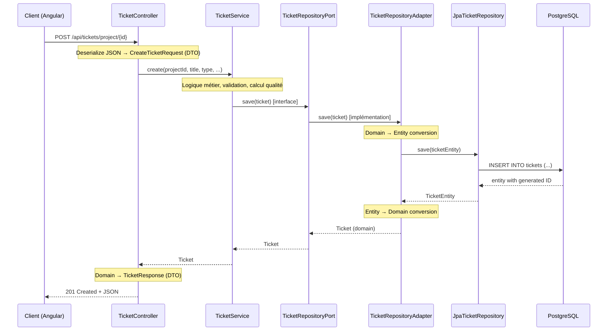

# Architecture Hexagonale — Tutoriel

## Pourquoi une architecture hexagonale ?

L'architecture hexagonale (ou "Ports & Adapters", inventée par Alistair Cockburn) vise à **isoler le domaine métier** de toute dépendance technique. Le code métier ne sait pas s'il parle à une base PostgreSQL, un fichier CSV, ou une API externe.

### Problème résolu

Dans une architecture classique en couches (Controller → Service → Repository), le service métier dépend directement de Spring Data JPA, de la base de données, et de la structure HTTP. Résultat :
- Impossible de tester le métier sans la BDD
- Un changement de framework impacte le domaine
- Le code métier est pollué par des annotations techniques

### Solution hexagonale

```
        ┌─────────────────────────────────────────┐
        │              INFRASTRUCTURE              │
        │  ┌─────────┐          ┌──────────────┐  │
        │  │ REST API│          │  PostgreSQL  │  │
        │  │Controller│          │  Adapter     │  │
        │  └────┬────┘          └──────┬───────┘  │
        │       │                      │          │
        │───────┼──────────────────────┼──────────│
        │       ▼                      ▲          │
        │  ┌─────────────────────────────────┐    │
        │  │         APPLICATION              │    │
        │  │  ┌───────────────────────────┐   │    │
        │  │  │        Services           │   │    │
        │  │  └─────────┬─────────────────┘   │    │
        │  └────────────┼─────────────────────┘    │
        │               ▼                          │
        │  ┌─────────────────────────────────┐    │
        │  │           DOMAIN                 │    │
        │  │  Models, Ports (interfaces),     │    │
        │  │  Business Rules, Exceptions      │    │
        │  └─────────────────────────────────┘    │
        └─────────────────────────────────────────┘
```

**Règle d'or** : Les dépendances pointent toujours vers l'intérieur (vers le domaine).

---

## Les 3 couches dans AgileForge

### 1. Domain (le coeur)

```
domain/
├── model/          # Entités métier pures (Ticket, Project, Sprint...)
├── port/out/       # Interfaces de sortie (TicketRepositoryPort, etc.)
└── exception/      # Exceptions métier (EntityNotFoundException, BusinessException)
```

Le domaine :
- Ne dépend d'**aucun** framework (pas de Spring, pas de JPA)
- Contient les **règles métier** (un ticket ne peut pas passer de DONE à BACKLOG)
- Définit des **ports** (interfaces) que le monde extérieur doit implémenter

**Exemple : modèle Ticket**

```java
// domain/model/Ticket.java — Aucune annotation Spring/JPA
public class Ticket {
    private UUID id;
    private UUID projectId;
    private String key;
    private long number;
    private String title;
    private TicketStatus status;
    private TicketPriority priority;
    // ... getters/setters explicites, pas de Lombok

    public void calculateQualityScore() {
        int score = 0;
        if (title != null && title.length() > 10) score += 20;
        if (description != null && description.length() > 50) score += 30;
        if (priority != null) score += 15;
        if (storyPoints != null) score += 15;
        if (assigneeId != null) score += 20;
        this.qualityScore = Math.min(score, 100);
    }
}
```

**Exemple : port de sortie**

```java
// domain/port/out/TicketRepositoryPort.java
public interface TicketRepositoryPort {
    Ticket save(Ticket ticket);
    Optional<Ticket> findById(UUID id);
    List<Ticket> findByProjectId(UUID projectId);
    List<Ticket> findByAssigneeId(UUID assigneeId);
    long getNextNumber(UUID projectId);
    // ...
}
```

Le domaine dit : "J'ai besoin de persister des tickets", sans dire comment.

---

### 2. Application (orchestration)

```
application/
├── service/        # Services applicatifs (TicketService, SprintService...)
└── dto/
    ├── request/    # DTOs d'entrée (CreateTicketRequest)
    └── response/   # DTOs de sortie (TicketResponse)
```

La couche application :
- **Orchestre** les appels entre le domaine et l'infrastructure
- Gère les **transactions** (@Transactional)
- Fait la **validation** métier (au-delà de la validation de format)
- Utilise les **ports** définis par le domaine

**Exemple : TicketService**

```java
@Service
@Transactional
public class TicketService {

    private final TicketRepositoryPort ticketRepository;    // Port !
    private final ProjectRepositoryPort projectRepository;  // Port !

    public TicketService(TicketRepositoryPort ticketRepository, ...) {
        this.ticketRepository = ticketRepository;
        // Injection par constructeur — le service ne sait pas quelle implémentation est utilisée
    }

    public Ticket create(UUID projectId, String title, ...) {
        // 1. Récupérer le projet via le port
        Project project = projectRepository.findById(projectId)
                .orElseThrow(() -> new EntityNotFoundException("Project", projectId));

        // 2. Logique métier pure
        long nextNumber = ticketRepository.getNextNumber(projectId);
        Ticket ticket = new Ticket(projectId, project.getKey(), nextNumber, title, ...);
        ticket.calculateQualityScore();

        // 3. Persister via le port
        return ticketRepository.save(ticket);
    }
}
```

---

### 3. Infrastructure (détails techniques)

```
infrastructure/
├── persistence/
│   ├── entity/     # Entités JPA (TicketEntity) — avec Lombok
│   ├── adapter/    # Implémentations des ports (TicketRepositoryAdapter)
│   └── repository/ # Interfaces Spring Data JPA (JpaTicketRepository)
├── web/
│   └── controller/ # Contrôleurs REST (TicketController)
└── security/       # JWT, filtres, configuration sécurité
```

L'infrastructure :
- **Implémente** les ports définis par le domaine
- Gère les détails techniques (JPA, HTTP, JWT, Redis)
- Fait la **conversion** entre modèles du domaine et entités techniques

**Exemple : Adapter (implémente le port)**

```java
@Component
public class TicketRepositoryAdapter implements TicketRepositoryPort {

    private final JpaTicketRepository jpaRepository;

    @Override
    public Ticket save(Ticket ticket) {
        TicketEntity entity = toEntity(ticket);
        TicketEntity saved = jpaRepository.save(entity);
        return toDomain(saved);
    }

    @Override
    public Optional<Ticket> findById(UUID id) {
        return jpaRepository.findById(id).map(this::toDomain);
    }

    // Conversion Entity ↔ Domain
    private Ticket toDomain(TicketEntity e) {
        Ticket t = new Ticket();
        t.setId(e.getId());
        t.setTitle(e.getTitle());
        // ...
        return t;
    }

    private TicketEntity toEntity(Ticket t) {
        TicketEntity e = new TicketEntity();
        e.setId(t.getId());
        e.setTitle(t.getTitle());
        // ...
        return e;
    }
}
```

---

## Flux complet d'une requête

Suivons la création d'un ticket depuis la requête HTTP jusqu'à la base de données :



---

## Pourquoi deux modèles (Domain vs Entity) ?

| Aspect | Domain Model (`Ticket`) | JPA Entity (`TicketEntity`) |
|--------|------------------------|-----------------------------|
| Annotations | Aucune | @Entity, @Table, @Column |
| Lombok | Non (getters/setters explicites) | Oui (@Getter @Setter) |
| Dépendances | Aucune librairie externe | Jakarta Persistence, Lombok |
| Rôle | Règles métier | Mapping BDD |
| Testabilité | Instantanéable sans contexte | Nécessite un contexte JPA |

Cette séparation permet de :
1. **Tester le domaine** sans base de données
2. **Changer de BDD** sans toucher au métier (PostgreSQL → MongoDB)
3. **Évoluer le schéma** indépendamment des règles métier

---

## Comparaison avec d'autres architectures

| Critère | Architecture en couches | Hexagonale | Clean Architecture |
|---------|------------------------|------------|-------------------|
| Complexité | Faible | Moyenne | Élevée |
| Testabilité | Moyenne | Élevée | Élevée |
| Couplage | Fort | Faible | Très faible |
| Nombre de fichiers | Peu | Moyen | Beaucoup |
| Adapté pour | CRUD simple | Domaine riche | Très gros projets |

AgileForge utilise l'hexagonale car le domaine est suffisamment riche (tickets avec workflows, règles de transition, calculs de vélocité) pour justifier l'isolation, sans aller jusqu'à la complexité de la Clean Architecture.

---

## Avantages constatés dans AgileForge

1. **Tests unitaires rapides** : On peut tester `TicketService` avec un mock de `TicketRepositoryPort` — pas besoin de PostgreSQL
2. **Évolution facile** : Ajouter Redis comme cache = créer un nouvel adapter, sans modifier le service
3. **Lisibilité** : En lisant un port, on sait exactement ce dont le domaine a besoin
4. **Remplaçabilité** : Changer Spring Data pour jOOQ = réécrire l'adapter, pas le service

## Inconvénients

1. **Plus de fichiers** : Pour chaque concept, on a Model + Port + Entity + Adapter + Repository
2. **Mapping fastidieux** : Les conversions Domain ↔ Entity sont répétitives
3. **Overkill pour du CRUD** : Si un endpoint ne fait que passer des données, l'hexagonale ajoute de la cérémonie inutile

---

## Exercice mental

Pour vérifier que vous comprenez l'architecture, répondez à ces questions :

1. Si je veux ajouter un cache Redis pour les tickets, quels fichiers dois-je modifier ?
   → Réponse : Uniquement l'Adapter (ou créer un decorator autour de l'adapter existant)

2. Si je veux exposer les tickets via GraphQL au lieu de REST, que dois-je changer ?
   → Réponse : Ajouter un resolver GraphQL dans `infrastructure/web/` qui appelle le même `TicketService`

3. Si je veux changer une règle métier (ex: un ticket BUG doit obligatoirement avoir un environnement), où est-ce ?
   → Réponse : Dans `domain/model/Ticket.java` ou dans `TicketService`
