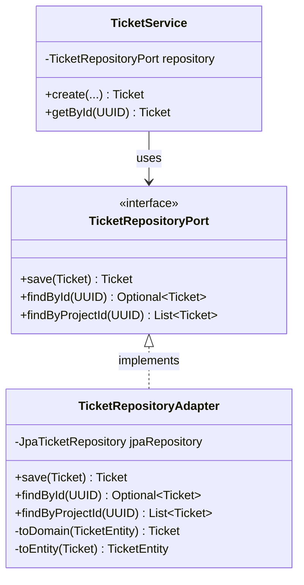
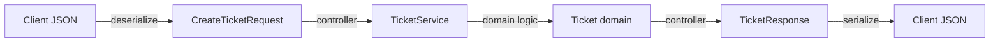
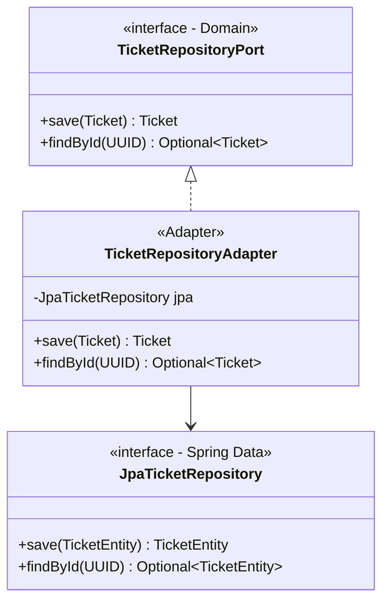
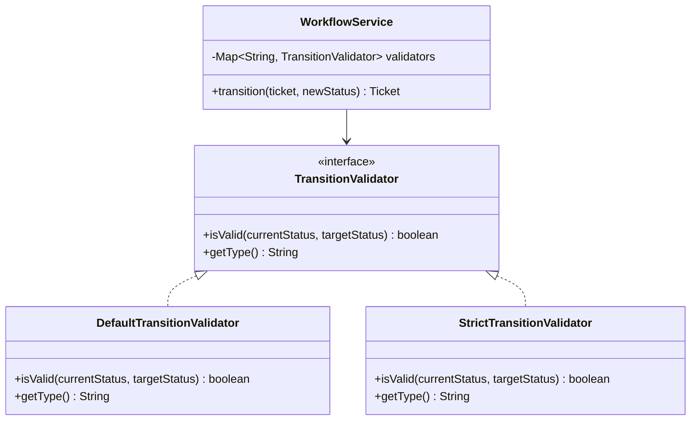
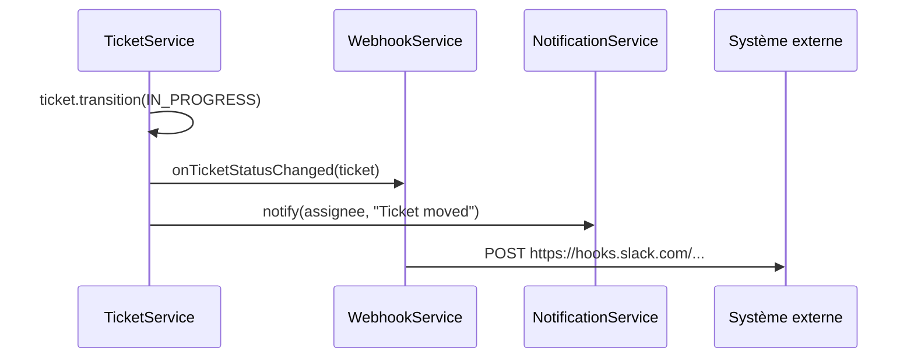
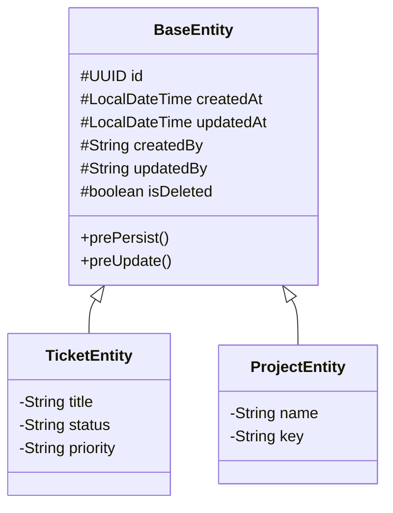

# Patterns de Design dans AgileForge

Ce document présente les principaux patterns de design utilisés dans le projet, avec pour chaque pattern : une explication, un diagramme, et un exemple concret tiré du code.

---

## 1. Repository Pattern

### Explication

Le Repository Pattern abstrait l'accès aux données derrière une interface. Le code métier manipule des objets du domaine sans savoir comment ils sont stockés (PostgreSQL, MongoDB, mémoire...).

### Diagramme



### Exemple dans AgileForge

```java
// 1. Le Port (interface dans le domaine)
public interface TicketRepositoryPort {
    Ticket save(Ticket ticket);
    Optional<Ticket> findById(UUID id);
    List<Ticket> findByProjectId(UUID projectId);
    long getNextNumber(UUID projectId);
}

// 2. L'Adapter (implémentation dans l'infrastructure)
@Component
public class TicketRepositoryAdapter implements TicketRepositoryPort {
    private final JpaTicketRepository jpa;

    @Override
    public Ticket save(Ticket ticket) {
        return toDomain(jpa.save(toEntity(ticket)));
    }
}

// 3. Le Service (consomme le port)
@Service
public class TicketService {
    private final TicketRepositoryPort ticketRepository; // Interface !
}
```

**Pourquoi c'est utile** : On peut écrire un `InMemoryTicketRepository` pour les tests unitaires sans toucher à la BDD.

---

## 2. DTO Pattern (Data Transfer Object)

### Explication

Les DTOs sont des objets de transport qui définissent exactement les données échangées avec l'extérieur. Ils isolent le modèle interne de l'API publique.

### Diagramme



### Exemple dans AgileForge

```java
// Request DTO — Ce que le client envoie
public record CreateTicketRequest(
    @NotBlank @Size(min = 5, max = 500)
    String title,
    String description,
    @NotNull String type,
    String priority,
    UUID assigneeId,
    Integer storyPoints,
    String dueDate
) {}

// Response DTO — Ce que le client reçoit
public record TicketResponse(
    UUID id,
    UUID projectId,
    String fullKey,      // "PROJ-42"
    String key,
    long number,
    String title,
    String description,
    String type,
    String status,
    String priority,
    // ... pas les champs internes comme qualityScore calculé
    LocalDateTime createdAt,
    LocalDateTime updatedAt
) {}
```

**Avantages** :
- Le client ne voit que ce qu'il doit voir (pas les champs internes)
- La validation est sur le DTO, pas sur le modèle domaine
- On peut faire évoluer le modèle interne sans casser l'API

---

## 3. Adapter Pattern

### Explication

L'Adapter convertit une interface en une autre. Dans AgileForge, il adapte l'interface Spring Data JPA vers l'interface du domaine (Port).

### Diagramme



### Exemple concret

```java
@Component
public class TicketRepositoryAdapter implements TicketRepositoryPort {
    private final JpaTicketRepository jpa;

    @Override
    public Optional<Ticket> findById(UUID id) {
        // Adapte : JPA Entity → Domain Model
        return jpa.findById(id).map(this::toDomain);
    }

    @Override
    public Ticket save(Ticket ticket) {
        // Adapte : Domain Model → JPA Entity → save → JPA Entity → Domain Model
        TicketEntity entity = toEntity(ticket);
        TicketEntity saved = jpa.save(entity);
        return toDomain(saved);
    }

    private Ticket toDomain(TicketEntity e) { /* mapping */ }
    private TicketEntity toEntity(Ticket t) { /* mapping */ }
}
```

---

## 4. Strategy Pattern

### Explication

Le Strategy Pattern permet de choisir un algorithme à l'exécution. Dans AgileForge, le workflow engine utilise ce pattern pour appliquer différentes règles de transition selon le type de workflow.

### Diagramme



### Exemple conceptuel

```java
// Le workflow vérifie si une transition est autorisée
public Ticket transition(UUID id, TicketStatus newStatus, UUID userId) {
    Ticket ticket = getById(id);
    String oldStatus = ticket.getStatus().name();

    // Validation : on ne peut pas rester au même statut
    if (ticket.getStatus() == newStatus) {
        throw new BusinessException("Ticket is already in status: " + newStatus);
    }

    // La stratégie de validation pourrait vérifier les transitions autorisées
    // Ex: BACKLOG → IN_PROGRESS OK, mais DONE → BACKLOG interdit
    ticket.setStatus(newStatus);
    return ticketRepository.save(ticket);
}
```

---

## 5. Observer Pattern (via Events)

### Explication

Le pattern Observer permet à des composants d'être notifiés quand un événement se produit, sans couplage direct. AgileForge l'utilise pour les webhooks et notifications.

### Diagramme



### Exemple dans AgileForge

```java
// WebhookService notifie les abonnés quand un événement se produit
@Service
public class WebhookService {
    private final WebhookRepositoryPort webhookRepository;

    public void triggerEvent(String eventType, UUID projectId, Map<String, Object> payload) {
        List<WebhookSubscription> subscribers = webhookRepository
            .findByProjectIdAndEventType(projectId, eventType);

        for (WebhookSubscription sub : subscribers) {
            // Envoyer le payload à l'URL configurée
            sendWebhook(sub.getTargetUrl(), payload);
        }
    }
}
```

---

## 6. Builder Pattern (implicite via setters chaînés)

### Explication

Le Builder Pattern construit des objets complexes étape par étape. Dans AgileForge, la création de tickets utilise un builder implicite via les setters.

### Exemple dans AgileForge

```java
// Création d'un ticket avec de nombreux champs optionnels
public Ticket create(UUID projectId, String title, String type, ...) {
    // Construction progressive de l'objet
    Ticket ticket = new Ticket(projectId, project.getKey(), nextNumber, title, ticketType, priority, reporterId);

    // Champs optionnels
    ticket.setDescription(description);
    ticket.setAssigneeId(assigneeId);
    ticket.setEpicId(epicId);
    ticket.setParentId(parentId);
    ticket.setStoryPoints(storyPoints);
    ticket.setEstimatedHours(estimatedHours);
    if (dueDate != null) ticket.setDueDate(LocalDate.parse(dueDate));
    ticket.setEnvironment(environment);
    ticket.setComponent(component);
    ticket.setLabels(labels);

    // Calcul dérivé
    ticket.calculateQualityScore();

    return ticketRepository.save(ticket);
}
```

Un vrai Builder serait :
```java
Ticket ticket = Ticket.builder()
    .projectId(projectId)
    .title(title)
    .type(ticketType)
    .description(description)
    .assigneeId(assigneeId)
    .build();
```

---

## 7. Template Method Pattern (via BaseEntity)

### Explication

Le Template Method définit le squelette d'un algorithme dans une classe parent. Dans AgileForge, `BaseEntity` fournit les champs communs à toutes les entités.

### Diagramme



### Exemple

```java
@MappedSuperclass
public abstract class BaseEntity {
    @Id
    private UUID id;

    @Column(name = "created_at")
    private LocalDateTime createdAt;

    @Column(name = "updated_at")
    private LocalDateTime updatedAt;

    @PrePersist
    protected void onCreate() {
        this.id = UUID.randomUUID();
        this.createdAt = LocalDateTime.now();
        this.updatedAt = LocalDateTime.now();
    }

    @PreUpdate
    protected void onUpdate() {
        this.updatedAt = LocalDateTime.now();
    }
}

// Toutes les entités héritent automatiquement de id, createdAt, updatedAt
@Entity
@Table(name = "tickets")
public class TicketEntity extends BaseEntity {
    private String title;
    // ... pas besoin de redéfinir id, createdAt, etc.
}
```

---

## Résumé

| Pattern | Où dans AgileForge | Problème résolu |
|---------|-------------------|-----------------|
| Repository | `domain/port/out/` + `infrastructure/persistence/adapter/` | Découpler le domaine de la BDD |
| DTO | `application/dto/request/` et `response/` | Contrôler l'API publique |
| Adapter | `infrastructure/persistence/adapter/` | Convertir entre interfaces |
| Strategy | `WorkflowService`, transitions | Algorithme interchangeable |
| Observer | `WebhookService`, `NotificationService` | Notification sans couplage |
| Builder | Création de `Ticket` | Construire des objets complexes |
| Template Method | `BaseEntity` | Factoriser le comportement commun |
