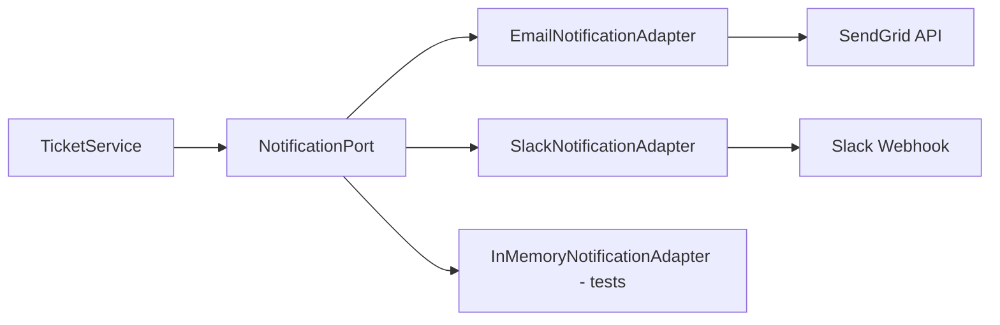

# Exercices Pratiques

Ces exercices vous permettent d'apprendre en contribuant au projet. Ils sont progressifs : commencez par le premier et montez en complexité.

---

## Exercice 1 : Ajouter un champ à un ticket (Débutant)

### Objectif
Ajouter un champ `resolution` (type String) aux tickets. Ce champ indique comment le ticket a été résolu (FIXED, WONT_FIX, DUPLICATE, CANNOT_REPRODUCE).

### Compétences travaillées
- Modification d'une entité JPA
- Migration Flyway
- Mise à jour du domaine
- Modification d'un DTO

### Étapes

**Étape 1 : Migration Flyway**

Créer `V21__add_ticket_resolution.sql` :
```sql
ALTER TABLE tickets ADD COLUMN resolution VARCHAR(30);
```

**Étape 2 : Entité JPA**

Dans `TicketEntity.java`, ajouter :
```java
@Column(length = 30)
private String resolution;
```

**Étape 3 : Modèle domaine**

Dans `Ticket.java`, ajouter le champ et son getter/setter :
```java
private String resolution;

public String getResolution() { return resolution; }
public void setResolution(String resolution) { this.resolution = resolution; }
```

**Étape 4 : DTO Response**

Dans `TicketResponse.java`, ajouter le champ dans le record :
```java
public record TicketResponse(
    // ... champs existants ...,
    String resolution,    // ← nouveau
    LocalDateTime createdAt,
    LocalDateTime updatedAt
) {}
```

**Étape 5 : Mapping dans le contrôleur**

Dans `TicketController.toResponse()`, ajouter `t.getResolution()` au bon endroit.

**Étape 6 : Mapping dans l'adapter**

Dans `TicketRepositoryAdapter`, mettre à jour `toDomain()` et `toEntity()` pour mapper le nouveau champ.

### Vérification

```bash
mvn compile  # Doit compiler sans erreur
mvn test     # Les tests existants doivent toujours passer
```

### Bonus
- Créer un enum `TicketResolution` au lieu d'un simple String
- Ajouter la résolution dans `UpdateTicketRequest`
- Enregistrer le changement dans l'historique

---

## Exercice 2 : Créer une entité complète (Intermédiaire)

### Objectif
Créer un système de **tags personnalisés** pour les projets. Un tag a un nom, une couleur, et appartient à un projet. Les tags peuvent être associés aux tickets (relation many-to-many).

### Compétences travaillées
- Création complète d'une feature (BDD → API)
- Architecture hexagonale de bout en bout
- Relations JPA

### Étapes

**Étape 1 : Migration Flyway**

Créer `V21__custom_tags.sql` :
```sql
CREATE TABLE custom_tags (
    id UUID PRIMARY KEY DEFAULT gen_random_uuid(),
    project_id UUID NOT NULL REFERENCES projects(id),
    name VARCHAR(50) NOT NULL,
    color VARCHAR(7) NOT NULL DEFAULT '#58a6ff',
    description VARCHAR(200),
    created_at TIMESTAMP DEFAULT NOW(),
    updated_at TIMESTAMP DEFAULT NOW(),
    UNIQUE(project_id, name)
);

CREATE TABLE ticket_tags (
    ticket_id UUID NOT NULL REFERENCES tickets(id) ON DELETE CASCADE,
    tag_id UUID NOT NULL REFERENCES custom_tags(id) ON DELETE CASCADE,
    PRIMARY KEY (ticket_id, tag_id)
);

CREATE INDEX idx_custom_tags_project ON custom_tags(project_id);
CREATE INDEX idx_ticket_tags_ticket ON ticket_tags(ticket_id);
```

**Étape 2 : Modèle domaine**

Créer `domain/model/CustomTag.java` :
```java
public class CustomTag {
    private UUID id;
    private UUID projectId;
    private String name;
    private String color;
    private String description;
    private LocalDateTime createdAt;
    private LocalDateTime updatedAt;

    // Constructeur, getters, setters
}
```

**Étape 3 : Port**

Créer `domain/port/out/CustomTagRepositoryPort.java` :
```java
public interface CustomTagRepositoryPort {
    CustomTag save(CustomTag tag);
    Optional<CustomTag> findById(UUID id);
    List<CustomTag> findByProjectId(UUID projectId);
    void delete(UUID id);
    void addTagToTicket(UUID ticketId, UUID tagId);
    void removeTagFromTicket(UUID ticketId, UUID tagId);
    List<CustomTag> findByTicketId(UUID ticketId);
}
```

**Étape 4 : Entité JPA**

Créer `infrastructure/persistence/entity/CustomTagEntity.java` :
```java
@Entity
@Table(name = "custom_tags")
@Getter @Setter @NoArgsConstructor @AllArgsConstructor
public class CustomTagEntity extends BaseEntity {
    @Column(name = "project_id", nullable = false)
    private UUID projectId;

    @Column(nullable = false, length = 50)
    private String name;

    @Column(nullable = false, length = 7)
    private String color;

    @Column(length = 200)
    private String description;
}
```

**Étape 5 : Repository Spring Data**

Créer `infrastructure/persistence/repository/JpaCustomTagRepository.java` :
```java
public interface JpaCustomTagRepository extends JpaRepository<CustomTagEntity, UUID> {
    List<CustomTagEntity> findByProjectId(UUID projectId);
}
```

**Étape 6 : Adapter**

Créer `infrastructure/persistence/adapter/CustomTagRepositoryAdapter.java` qui implémente `CustomTagRepositoryPort`.

**Étape 7 : DTOs**

```java
// CreateTagRequest.java
public record CreateTagRequest(
    @NotBlank @Size(max = 50) String name,
    @Pattern(regexp = "^#[0-9a-fA-F]{6}$") String color,
    @Size(max = 200) String description
) {}

// TagResponse.java
public record TagResponse(UUID id, UUID projectId, String name, String color, String description) {}
```

**Étape 8 : Service**

Créer `application/service/CustomTagService.java` avec les méthodes CRUD + association.

**Étape 9 : Contrôleur**

Créer `infrastructure/web/controller/CustomTagController.java` :
- `POST /tags/project/{projectId}` — Créer un tag
- `GET /tags/project/{projectId}` — Lister les tags d'un projet
- `DELETE /tags/{id}` — Supprimer un tag
- `POST /tags/{tagId}/tickets/{ticketId}` — Associer tag ↔ ticket
- `DELETE /tags/{tagId}/tickets/{ticketId}` — Dissocier

### Vérification

```bash
mvn compile && mvn test
# Tester avec curl :
curl -X POST http://localhost:8080/tags/project/{id} \
  -H "Authorization: Bearer <token>" \
  -H "Content-Type: application/json" \
  -d '{"name": "Backend", "color": "#3fb950"}'
```

---

## Exercice 3 : Fonctionnalité complète avec Frontend (Avancé)

### Objectif
Implémenter un système de **favoris** : un utilisateur peut marquer des tickets comme favoris et les retrouver facilement.

### Compétences travaillées
- Full-stack (BDD → API → UI)
- Angular Signals
- Communication frontend ↔ backend

### Étapes Backend

1. **Migration** `V21__user_favorites.sql` :
```sql
CREATE TABLE user_favorites (
    user_id UUID NOT NULL REFERENCES users(id),
    ticket_id UUID NOT NULL REFERENCES tickets(id) ON DELETE CASCADE,
    created_at TIMESTAMP DEFAULT NOW(),
    PRIMARY KEY (user_id, ticket_id)
);
```

2. **Domain** : Pas de modèle complexe nécessaire, juste un port :
```java
public interface FavoriteRepositoryPort {
    void addFavorite(UUID userId, UUID ticketId);
    void removeFavorite(UUID userId, UUID ticketId);
    List<UUID> findFavoriteTicketIds(UUID userId);
    boolean isFavorite(UUID userId, UUID ticketId);
}
```

3. **Service** : `FavoriteService` avec toggle, list

4. **Contrôleur** :
   - `POST /favorites/{ticketId}` — Toggle favori
   - `GET /favorites` — Mes favoris
   - `GET /favorites/{ticketId}/status` — Est-ce un favori ?

### Étapes Frontend

5. **Model** `favorite.model.ts` :
```typescript
export interface FavoriteStatus {
  ticketId: string;
  isFavorite: boolean;
}
```

6. **Service** `favorite.service.ts` :
```typescript
@Injectable({ providedIn: 'root' })
export class FavoriteService {
  private http = inject(HttpClient);
  favorites = signal<string[]>([]);

  loadFavorites() {
    this.http.get<Ticket[]>(`${environment.apiUrl}/favorites`).subscribe(
      tickets => this.favorites.set(tickets.map(t => t.id))
    );
  }

  toggleFavorite(ticketId: string) {
    this.http.post(`${environment.apiUrl}/favorites/${ticketId}`, {}).subscribe(() => {
      const current = this.favorites();
      if (current.includes(ticketId)) {
        this.favorites.set(current.filter(id => id !== ticketId));
      } else {
        this.favorites.set([...current, ticketId]);
      }
    });
  }

  isFavorite(ticketId: string): boolean {
    return this.favorites().includes(ticketId);
  }
}
```

7. **Composant bouton favori** :
```typescript
@Component({
  selector: 'app-favorite-button',
  standalone: true,
  template: `
    <button (click)="toggle()" [class.active]="isFav()">
      @if (isFav()) { ★ } @else { ☆ }
    </button>
  `,
  styles: `
    button { background: none; border: none; cursor: pointer; font-size: 20px; color: #8b949e; }
    button.active { color: #d29922; }
  `
})
export class FavoriteButtonComponent {
  ticketId = input.required<string>();
  private favoriteService = inject(FavoriteService);

  isFav = computed(() => this.favoriteService.isFavorite(this.ticketId()));

  toggle() {
    this.favoriteService.toggleFavorite(this.ticketId());
  }
}
```

8. **Intégrer** dans le composant ticket-card et la page "Mes favoris"

### Vérification
- Le bouton ★/☆ fonctionne sur chaque carte ticket
- La page "Mes favoris" affiche la liste
- Le favori persiste après refresh (appel API)

---

## Exercice 4 : Module d'intégration externe (Expert)

### Objectif
Implémenter une intégration avec un service externe de notifications (ex: envoi d'emails via un service SMTP ou une API comme SendGrid). Quand un ticket est assigné à quelqu'un, cette personne reçoit un email.

### Compétences travaillées
- Intégration avec un service externe
- Pattern Port/Adapter pour l'isolation
- Gestion des erreurs réseau
- Configuration par environnement
- Tests avec mock du service externe

### Architecture



### Étapes

1. **Définir le port de notification** :
```java
// domain/port/out/NotificationPort.java
public interface NotificationPort {
    void sendAssignmentNotification(UUID userId, String ticketKey, String ticketTitle);
    void sendStatusChangeNotification(UUID userId, String ticketKey, String oldStatus, String newStatus);
    void sendMentionNotification(UUID userId, String ticketKey, String mentionedBy);
}
```

2. **Créer l'adapter email** :
```java
@Component
@ConditionalOnProperty(name = "notifications.email.enabled", havingValue = "true")
public class EmailNotificationAdapter implements NotificationPort {
    @Value("${notifications.email.from}") private String fromEmail;
    @Value("${notifications.email.api-key}") private String apiKey;

    private final UserRepositoryPort userRepository;

    @Override
    public void sendAssignmentNotification(UUID userId, String ticketKey, String ticketTitle) {
        User user = userRepository.findById(userId).orElseReturn;
        // Appeler l'API d'envoi d'email
        sendEmail(user.getEmail(), "Ticket assigned: " + ticketKey,
            "You have been assigned to " + ticketKey + ": " + ticketTitle);
    }

    private void sendEmail(String to, String subject, String body) {
        // RestTemplate ou WebClient vers l'API email
    }
}
```

3. **Adapter pour les tests** :
```java
@Component
@ConditionalOnProperty(name = "notifications.email.enabled", havingValue = "false", matchIfMissing = true)
public class InMemoryNotificationAdapter implements NotificationPort {
    private final List<String> sentNotifications = new ArrayList<>();

    @Override
    public void sendAssignmentNotification(UUID userId, String ticketKey, String ticketTitle) {
        sentNotifications.add("ASSIGN:" + userId + ":" + ticketKey);
        // Log au lieu d'envoyer
    }

    public List<String> getSentNotifications() { return sentNotifications; }
}
```

4. **Intégrer dans TicketService** :
```java
public class TicketService {
    private final NotificationPort notificationPort;

    public Ticket update(UUID id, ..., UUID assigneeId, ...) {
        Ticket ticket = getById(id);
        if (assigneeId != null && !assigneeId.equals(ticket.getAssigneeId())) {
            ticket.setAssigneeId(assigneeId);
            notificationPort.sendAssignmentNotification(assigneeId, ticket.getFullKey(), ticket.getTitle());
        }
    }
}
```

5. **Configuration** :
```yaml
# application.yml
notifications:
  email:
    enabled: false  # true en production
    from: noreply@agileforge.com
    api-key: ${SENDGRID_API_KEY}
```

6. **Tests** :
```java
@Test
void update_shouldSendNotification_whenAssigneeChanged() {
    InMemoryNotificationAdapter notifications = new InMemoryNotificationAdapter();
    TicketService service = new TicketService(ticketRepo, ..., notifications);

    service.update(ticketId, ..., newAssigneeId, ...);

    assertThat(notifications.getSentNotifications())
        .contains("ASSIGN:" + newAssigneeId + ":PROJ-1");
}
```

### Points clés
- Le domaine ne dépend pas de SendGrid/SMTP — seulement du port
- En test, on utilise un adapter en mémoire
- En développement, on peut logger au lieu d'envoyer
- En production, on utilise le vrai adapter
- Si on veut ajouter Slack, on crée un nouvel adapter sans modifier le service

### Vérification
- Les tests passent avec l'adapter in-memory
- En activant `notifications.email.enabled=true`, un vrai email est envoyé
- Le service fonctionne même si l'envoi échoue (catch + log, pas de crash)

---

## Conseils généraux

1. **Compilez souvent** : Après chaque modification, `mvn compile` pour détecter les erreurs tôt
2. **Petits commits** : Un commit par étape logique, pas un gros commit à la fin
3. **Tests d'abord** : Écrivez le test avant l'implémentation quand c'est possible (TDD)
4. **Lisez le code existant** : Avant de créer quelque chose, regardez comment c'est fait pour les tickets ou les sprints
5. **Demandez-vous "et si..."** : Et si le projet n'existe pas ? Et si l'utilisateur n'a pas les droits ? Et si l'email est invalide ?
