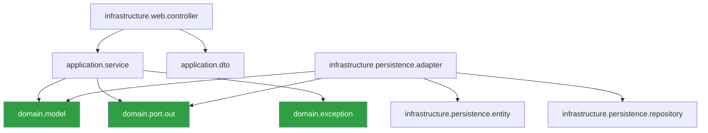

# Architecture Technique

## Vue d'ensemble

AgileForge suit une **architecture hexagonale** (Ports & Adapters) pour le backend et une architecture **composants standalone** pour le frontend Angular.

---

## Architecture globale du système

```
┌─────────────────────────────────────────────────────────────────────┐
│                         CLIENTS                                      │
│  ┌──────────────┐  ┌──────────────┐  ┌──────────────┐              │
│  │  Angular SPA │  │  Mobile App  │  │  API Keys    │              │
│  │  (port 4200) │  │  (futur)     │  │  (externe)   │              │
│  └──────┬───────┘  └──────┬───────┘  └──────┬───────┘              │
└─────────┼──────────────────┼─────────────────┼──────────────────────┘
          │                  │                 │
          ▼                  ▼                 ▼
┌─────────────────────────────────────────────────────────────────────┐
│                     API GATEWAY / REVERSE PROXY                       │
│                        (Nginx / Spring Cloud)                        │
└──────────────────────────────┬──────────────────────────────────────┘
                               │
                               ▼
┌─────────────────────────────────────────────────────────────────────┐
│                   SPRING BOOT BACKEND (port 8080)                     │
│                                                                       │
│  ┌─────────────────────────────────────────────────────────────┐    │
│  │                  INFRASTRUCTURE LAYER                         │    │
│  │  ┌─────────────┐  ┌──────────────┐  ┌───────────────────┐  │    │
│  │  │  REST API   │  │  Security    │  │  Persistence      │  │    │
│  │  │  Controllers│  │  JWT/CORS    │  │  JPA Adapters     │  │    │
│  │  └──────┬──────┘  └──────────────┘  └────────┬──────────┘  │    │
│  └─────────┼─────────────────────────────────────┼──────────────┘    │
│            │                                     │                    │
│  ┌─────────▼─────────────────────────────────────▼──────────────┐    │
│  │                   APPLICATION LAYER                           │    │
│  │              Services (orchestration, transactions)           │    │
│  └─────────────────────────────┬────────────────────────────────┘    │
│                                │                                      │
│  ┌─────────────────────────────▼────────────────────────────────┐    │
│  │                      DOMAIN LAYER                             │    │
│  │         Models, Ports (interfaces), Business Rules            │    │
│  └──────────────────────────────────────────────────────────────┘    │
└──────────────────────────────────────────────────────────────────────┘
          │              │              │
          ▼              ▼              ▼
┌──────────────┐ ┌────────────┐ ┌────────────────┐
│ PostgreSQL 16│ │  Redis 7   │ │  Kafka         │
│ (données)    │ │  (cache)   │ │  (événements)  │
└──────────────┘ └────────────┘ └────────────────┘
```

---

## Stack technologique

| Composant | Technologie | Version |
|-----------|------------|---------|
| Language backend | Java | 21 (LTS) |
| Framework backend | Spring Boot | 3.4.4 |
| ORM | Hibernate / JPA | 6.x |
| Migrations BDD | Flyway | 10.x |
| Base de données | PostgreSQL | 16 |
| Cache | Redis | 7 |
| Message broker | Apache Kafka | 3.x |
| Sécurité | Spring Security + JWT | 6.x |
| Documentation API | SpringDoc OpenAPI | 2.x |
| Build backend | Maven | 3.9+ |
| Language frontend | TypeScript | 5.x |
| Framework frontend | Angular | 21.2.0 |
| Build frontend | Angular CLI + esbuild | 21.x |
| Conteneurisation | Docker + Compose | 24+ |

---

## Couches de l'architecture hexagonale

### Domain Layer (coeur métier)

```
domain/
├── model/          # 30+ modèles métier
│   ├── Ticket.java
│   ├── TicketStatus.java (enum)
│   ├── TicketType.java (enum)
│   ├── TicketPriority.java (enum)
│   ├── Project.java
│   ├── Sprint.java
│   ├── Incident.java
│   ├── Portfolio.java
│   └── ...
├── port/out/       # 20+ interfaces de sortie
│   ├── TicketRepositoryPort.java
│   ├── ProjectRepositoryPort.java
│   ├── SprintRepositoryPort.java
│   └── ...
└── exception/
    ├── BusinessException.java
    └── EntityNotFoundException.java
```

**Règles** :
- Aucune dépendance vers Spring, JPA, ou tout framework
- Les modèles contiennent la logique métier (ex: `calculateQualityScore()`)
- Les ports définissent les **contrats** que l'infrastructure doit respecter

---

### Application Layer (orchestration)

```
application/
├── service/        # 20+ services applicatifs
│   ├── TicketService.java
│   ├── SprintService.java
│   ├── AuditService.java
│   ├── IncidentService.java
│   └── ...
└── dto/
    ├── request/    # 30+ DTOs d'entrée (records Java)
    └── response/   # 40+ DTOs de sortie (records Java)
```

**Responsabilités** :
- Gestion des transactions (`@Transactional`)
- Orchestration des appels entre ports
- Validation métier (au-delà de la validation de format)
- Transformation domain ↔ DTO

---

### Infrastructure Layer (détails techniques)

```
infrastructure/
├── persistence/
│   ├── entity/         # 30+ entités JPA (avec Lombok)
│   ├── adapter/        # 20+ adapters (implémentent les ports)
│   └── repository/     # 20+ interfaces Spring Data JPA
├── web/
│   └── controller/     # 35+ contrôleurs REST
└── security/
    ├── JwtService.java
    ├── JwtAuthenticationFilter.java
    └── SecurityConfig.java
```

---

## Flux de données

### Requête entrante (lecture)

```
HTTP GET /tickets/{id}
    → JwtFilter (vérifie le token)
    → TicketController.getById(id)
    → TicketService.getById(id)
    → TicketRepositoryPort.findById(id)     [interface]
    → TicketRepositoryAdapter.findById(id)  [implémentation]
    → JpaTicketRepository.findById(id)      [Spring Data]
    → PostgreSQL SELECT
    → TicketEntity
    → Adapter.toDomain() → Ticket
    → Controller.toResponse() → TicketResponse
    → HTTP 200 JSON
```

### Requête entrante (écriture)

```
HTTP POST /tickets/project/{projectId}
    → JwtFilter (vérifie le token)
    → TicketController.create(request, auth)
    → getCurrentUserId(auth) → UUID
    → TicketService.create(projectId, title, ...)
        → projectRepository.findById(projectId) [vérification]
        → ticketRepository.getNextNumber(projectId)
        → new Ticket(...) [construction domaine]
        → ticket.calculateQualityScore()
        → ticketRepository.save(ticket) [INSERT]
        → historyRepository.save(history) [audit]
    → Controller.toResponse(ticket)
    → HTTP 201 JSON
```

---

## Patterns architecturaux utilisés

| Pattern | Localisation | Usage |
|---------|-------------|-------|
| Hexagonal / Ports & Adapters | Global | Isolation du domaine |
| Repository | `domain/port/out/` | Abstraction de la persistence |
| DTO | `application/dto/` | Transport de données |
| Adapter | `infrastructure/persistence/adapter/` | Conversion port → Spring Data |
| Filter Chain | `infrastructure/security/` | Authentification JWT |
| Template Method | `BaseEntity` | Champs communs (id, dates) |
| Strategy | Workflow transitions | Règles configurables |
| Observer | Webhooks, Notifications | Événements découplés |

---

## Dépendances entre modules



**Flèche = "dépend de"**. Le domaine (vert) ne dépend de rien.

---

## Communication inter-services

Pour le moment, AgileForge est un **monolithe modulaire**. La communication est directe via injection de dépendances. L'architecture est prête pour une extraction en microservices si nécessaire :

- Chaque module (Tickets, Sprints, Incidents...) a son propre port
- Les événements (webhooks, notifications) sont découplés
- Kafka est disponible pour la communication asynchrone

---

## Scalabilité

| Axe | Solution |
|-----|----------|
| Horizontal (backend) | Stateless (JWT) → multiple instances derrière load balancer |
| Cache | Redis pour les données fréquemment lues |
| Base de données | Read replicas PostgreSQL |
| Événements | Kafka pour le traitement asynchrone |
| Frontend | CDN pour les assets statiques |
