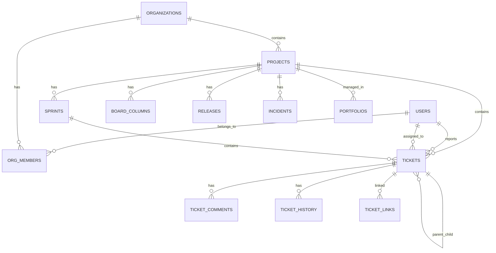

# Schéma de Base de Données

## Vue d'ensemble

- **SGBD** : PostgreSQL 16
- **Migrations** : Flyway (V1 à V20)
- **Total tables** : ~50 tables
- **Convention** : snake_case, UUID comme clé primaire, timestamps automatiques

---

## Migrations Flyway

| Version | Fichier | Tables créées |
|---------|---------|---------------|
| V1 | `V1__users_organizations_roles.sql` | `users`, `organizations`, `org_members`, `roles` |
| V2 | `V2__projects.sql` | `projects`, `project_members` |
| V3 | `V3__tickets_comments_history.sql` | `tickets`, `ticket_comments`, `ticket_history`, `ticket_links` |
| V4 | `V4__sprints_board_columns.sql` | `sprints`, `board_columns` |
| V5 | `V5__notifications_search.sql` | `notifications`, index full-text |
| V6 | `V6__workflow_engine.sql` | `workflows`, `workflow_transitions`, `workflow_rules` |
| V7 | `V7__labels_attachments.sql` | `labels`, `ticket_labels`, `attachments` |
| V8 | `V8__time_tracking.sql` | `time_entries` |
| V9 | `V9__invitations.sql` | `invitations` |
| V10 | `V10__saved_filters.sql` | `saved_filters` |
| V11 | `V11__releases_roadmap.sql` | `releases`, `milestones`, `milestone_dependencies` |
| V12 | `V12__git_integration.sql` | `git_repositories`, `git_branches`, `git_commits`, `git_pull_requests` |
| V13 | `V13__prompt_templates.sql` | `prompt_templates` |
| V14 | `V14__documentation.sql` | `documents`, `document_versions` |
| V15 | `V15__knowledge_base.sql` | `knowledge_entries`, `knowledge_tags` |
| V16 | `V16__okr_dora.sql` | `objectives`, `key_results`, `deployments` |
| V17 | `V17__audit_trail_enhanced.sql` | `audit_events`, `audit_alert_rules` |
| V18 | `V18__client_portal.sql` | `client_portals`, `client_users`, `client_feedback` |
| V19 | `V19__portfolio_capacity.sql` | `portfolios`, `portfolio_projects`, `capacity_entries` |
| V20 | `V20__incidents_webhooks.sql` | `incidents`, `incident_events`, `incident_participants`, `webhook_subscriptions`, `api_keys` |

---

## Tables principales

### Users & Organizations (V1)

```sql
CREATE TABLE users (
    id UUID PRIMARY KEY DEFAULT gen_random_uuid(),
    email VARCHAR(255) NOT NULL UNIQUE,
    password_hash VARCHAR(255) NOT NULL,
    first_name VARCHAR(100) NOT NULL,
    last_name VARCHAR(100) NOT NULL,
    avatar_url VARCHAR(500),
    is_active BOOLEAN DEFAULT true,
    created_at TIMESTAMP DEFAULT NOW(),
    updated_at TIMESTAMP DEFAULT NOW()
);

CREATE TABLE organizations (
    id UUID PRIMARY KEY DEFAULT gen_random_uuid(),
    name VARCHAR(200) NOT NULL,
    slug VARCHAR(100) NOT NULL UNIQUE,
    description TEXT,
    owner_id UUID NOT NULL REFERENCES users(id),
    created_at TIMESTAMP DEFAULT NOW(),
    updated_at TIMESTAMP DEFAULT NOW()
);

CREATE TABLE org_members (
    organization_id UUID NOT NULL REFERENCES organizations(id),
    user_id UUID NOT NULL REFERENCES users(id),
    role VARCHAR(30) NOT NULL DEFAULT 'DEVELOPER',
    joined_at TIMESTAMP DEFAULT NOW(),
    PRIMARY KEY (organization_id, user_id)
);
```

### Projects (V2)

```sql
CREATE TABLE projects (
    id UUID PRIMARY KEY DEFAULT gen_random_uuid(),
    organization_id UUID NOT NULL REFERENCES organizations(id),
    name VARCHAR(200) NOT NULL,
    key VARCHAR(10) NOT NULL,
    description TEXT,
    status VARCHAR(30) DEFAULT 'ACTIVE',
    owner_id UUID NOT NULL REFERENCES users(id),
    created_at TIMESTAMP DEFAULT NOW(),
    updated_at TIMESTAMP DEFAULT NOW(),
    UNIQUE(organization_id, key)
);

CREATE TABLE project_members (
    project_id UUID NOT NULL REFERENCES projects(id),
    user_id UUID NOT NULL REFERENCES users(id),
    role VARCHAR(30) NOT NULL DEFAULT 'DEVELOPER',
    PRIMARY KEY (project_id, user_id)
);
```

### Tickets (V3)

```sql
CREATE TABLE tickets (
    id UUID PRIMARY KEY DEFAULT gen_random_uuid(),
    project_id UUID NOT NULL REFERENCES projects(id),
    key VARCHAR(10) NOT NULL,
    number BIGINT NOT NULL,
    title VARCHAR(500) NOT NULL,
    description TEXT,
    type VARCHAR(30) NOT NULL,
    status VARCHAR(30) NOT NULL DEFAULT 'BACKLOG',
    priority VARCHAR(20) NOT NULL DEFAULT 'MEDIUM',
    assignee_id UUID REFERENCES users(id),
    reporter_id UUID NOT NULL REFERENCES users(id),
    epic_id UUID REFERENCES tickets(id),
    parent_id UUID REFERENCES tickets(id),
    sprint_id UUID REFERENCES sprints(id),
    story_points INTEGER,
    estimated_hours DOUBLE PRECISION,
    logged_hours DOUBLE PRECISION,
    due_date DATE,
    environment VARCHAR(50),
    component VARCHAR(100),
    labels VARCHAR(500),
    affected_version VARCHAR(50),
    fix_version VARCHAR(50),
    quality_score INTEGER DEFAULT 0,
    created_at TIMESTAMP DEFAULT NOW(),
    updated_at TIMESTAMP DEFAULT NOW(),
    UNIQUE(project_id, number)
);

CREATE TABLE ticket_comments (
    id UUID PRIMARY KEY DEFAULT gen_random_uuid(),
    ticket_id UUID NOT NULL REFERENCES tickets(id) ON DELETE CASCADE,
    author_id UUID NOT NULL REFERENCES users(id),
    content TEXT NOT NULL,
    created_at TIMESTAMP DEFAULT NOW(),
    updated_at TIMESTAMP DEFAULT NOW()
);

CREATE TABLE ticket_history (
    id UUID PRIMARY KEY DEFAULT gen_random_uuid(),
    ticket_id UUID NOT NULL REFERENCES tickets(id) ON DELETE CASCADE,
    user_id UUID NOT NULL REFERENCES users(id),
    field VARCHAR(50) NOT NULL,
    old_value TEXT,
    new_value TEXT,
    created_at TIMESTAMP DEFAULT NOW()
);

CREATE TABLE ticket_links (
    id UUID PRIMARY KEY DEFAULT gen_random_uuid(),
    source_ticket_id UUID NOT NULL REFERENCES tickets(id),
    target_ticket_id UUID NOT NULL REFERENCES tickets(id),
    link_type VARCHAR(30) NOT NULL,
    created_by UUID NOT NULL REFERENCES users(id),
    created_at TIMESTAMP DEFAULT NOW()
);
```

### Sprints & Board (V4)

```sql
CREATE TABLE sprints (
    id UUID PRIMARY KEY DEFAULT gen_random_uuid(),
    project_id UUID NOT NULL REFERENCES projects(id),
    name VARCHAR(200) NOT NULL,
    goal TEXT,
    start_date DATE,
    end_date DATE,
    status VARCHAR(30) NOT NULL DEFAULT 'PLANNED',
    velocity INTEGER,
    created_at TIMESTAMP DEFAULT NOW(),
    updated_at TIMESTAMP DEFAULT NOW()
);

CREATE TABLE board_columns (
    id UUID PRIMARY KEY DEFAULT gen_random_uuid(),
    project_id UUID NOT NULL REFERENCES projects(id),
    name VARCHAR(100) NOT NULL,
    status_mapping VARCHAR(30) NOT NULL,
    position INTEGER NOT NULL,
    wip_limit INTEGER,
    UNIQUE(project_id, position)
);
```

### Incidents (V20)

```sql
CREATE TABLE incidents (
    id UUID PRIMARY KEY DEFAULT gen_random_uuid(),
    project_id UUID NOT NULL REFERENCES projects(id),
    title VARCHAR(500) NOT NULL,
    description TEXT,
    severity VARCHAR(20) NOT NULL,
    status VARCHAR(30) NOT NULL DEFAULT 'OPEN',
    reported_by UUID NOT NULL REFERENCES users(id),
    assigned_to UUID REFERENCES users(id),
    started_at TIMESTAMP,
    resolved_at TIMESTAMP,
    root_cause TEXT,
    resolution TEXT,
    impact_description TEXT,
    affected_services VARCHAR(500),
    created_at TIMESTAMP DEFAULT NOW(),
    updated_at TIMESTAMP DEFAULT NOW()
);

CREATE TABLE incident_events (
    id UUID PRIMARY KEY DEFAULT gen_random_uuid(),
    incident_id UUID NOT NULL REFERENCES incidents(id) ON DELETE CASCADE,
    event_type VARCHAR(30) NOT NULL,
    description TEXT NOT NULL,
    author_id UUID NOT NULL REFERENCES users(id),
    created_at TIMESTAMP DEFAULT NOW()
);
```

---

## Diagramme des relations principales



---

## Index

Les index suivants sont créés pour les requêtes fréquentes :

```sql
-- Tickets
CREATE INDEX idx_tickets_project_id ON tickets(project_id);
CREATE INDEX idx_tickets_assignee_id ON tickets(assignee_id);
CREATE INDEX idx_tickets_status ON tickets(status);
CREATE INDEX idx_tickets_sprint_id ON tickets(sprint_id);
CREATE INDEX idx_tickets_epic_id ON tickets(epic_id);

-- Comments & History
CREATE INDEX idx_ticket_comments_ticket_id ON ticket_comments(ticket_id);
CREATE INDEX idx_ticket_history_ticket_id ON ticket_history(ticket_id);

-- Sprints
CREATE INDEX idx_sprints_project_id ON sprints(project_id);

-- Notifications
CREATE INDEX idx_notifications_user_id ON notifications(user_id);
CREATE INDEX idx_notifications_read ON notifications(user_id, is_read);

-- Audit
CREATE INDEX idx_audit_events_user_id ON audit_events(user_id);
CREATE INDEX idx_audit_events_timestamp ON audit_events(created_at);
CREATE INDEX idx_audit_events_action ON audit_events(action);
```

---

## Enums (valeurs possibles)

| Champ | Valeurs |
|-------|---------|
| `tickets.type` | STORY, BUG, TASK, EPIC, SUBTASK |
| `tickets.status` | BACKLOG, TODO, IN_PROGRESS, IN_REVIEW, TESTING, DONE, CANCELLED |
| `tickets.priority` | LOW, MEDIUM, HIGH, CRITICAL |
| `sprints.status` | PLANNED, ACTIVE, COMPLETED |
| `org_members.role` | ADMIN, MANAGER, DEVELOPER, VIEWER |
| `ticket_links.link_type` | BLOCKS, IS_BLOCKED_BY, RELATES_TO, DUPLICATES, IS_DUPLICATED_BY |
| `incidents.severity` | LOW, MEDIUM, HIGH, CRITICAL |
| `incidents.status` | OPEN, INVESTIGATING, IDENTIFIED, MONITORING, RESOLVED |

---

## Conventions SQL

- **Clés primaires** : UUID v4 générées par `gen_random_uuid()`
- **Timestamps** : `created_at` et `updated_at` sur toutes les tables
- **Soft delete** : Pas implémenté globalement (sauf `users.is_active`)
- **Cascade** : `ON DELETE CASCADE` pour les relations de composition (comments → ticket)
- **Contraintes** : `UNIQUE` pour les clés naturelles (project_id + number, org + key)
- **Types texte** : `VARCHAR(N)` pour les champs bornés, `TEXT` pour le contenu libre
